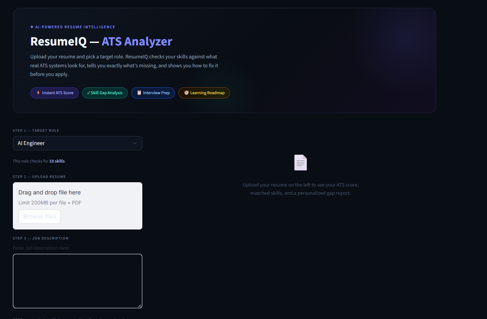
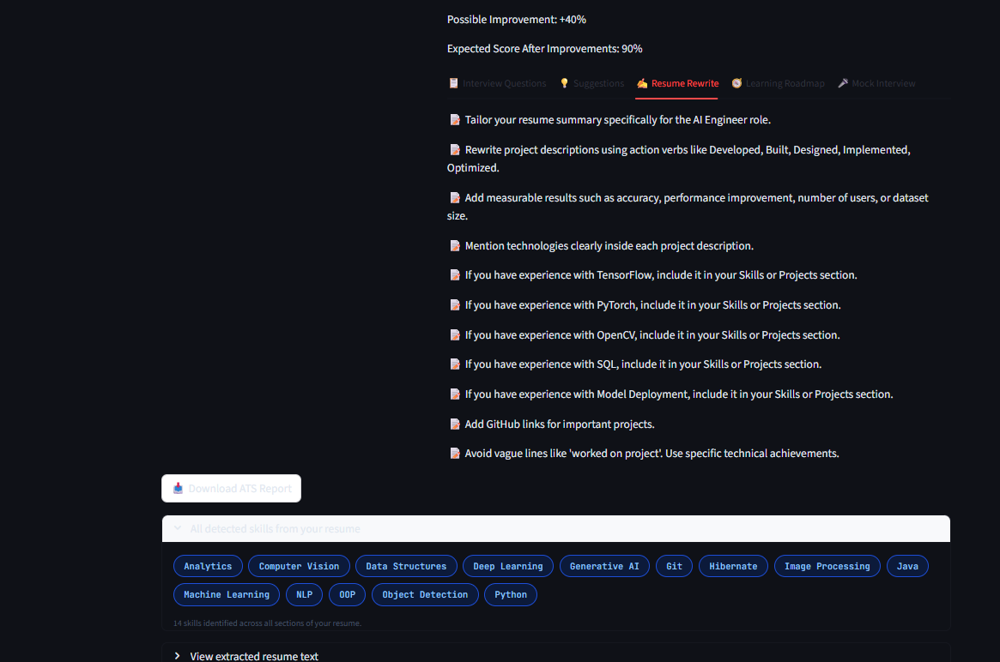
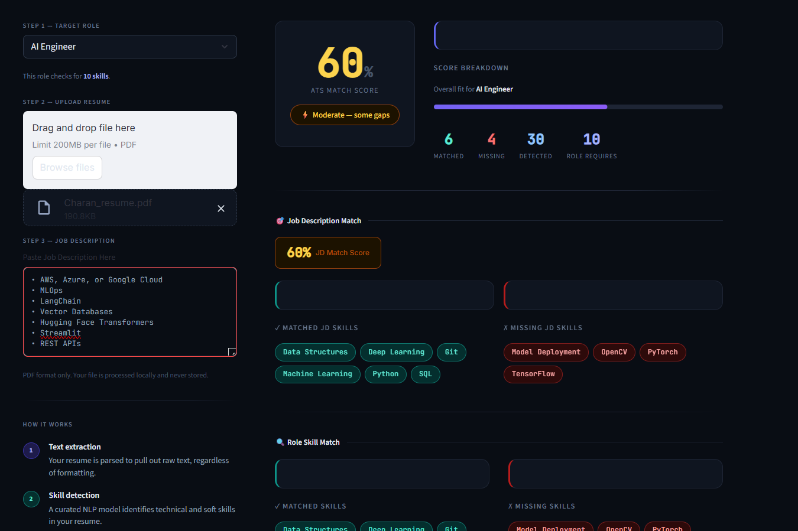
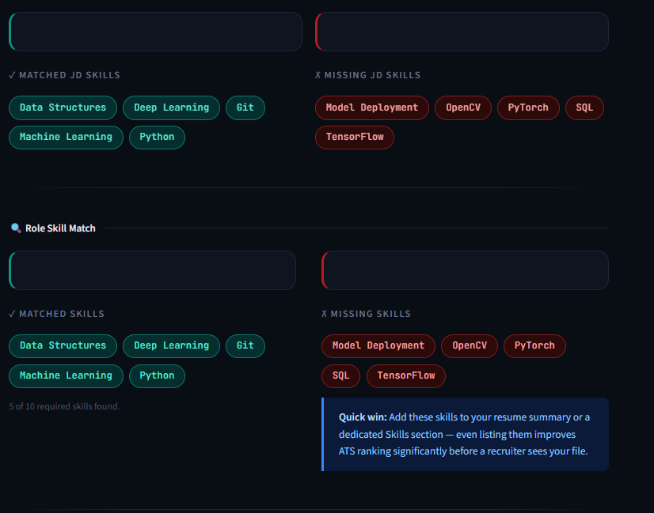
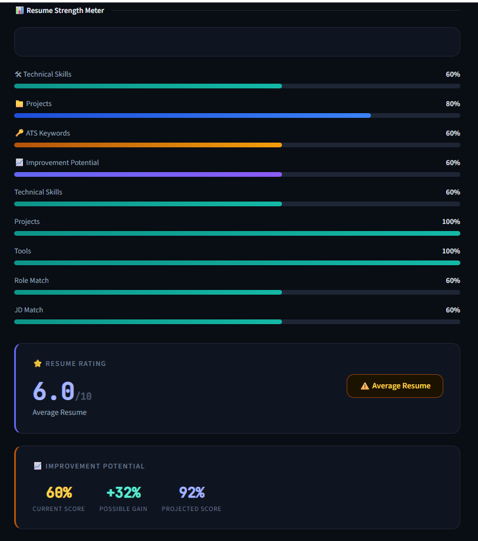
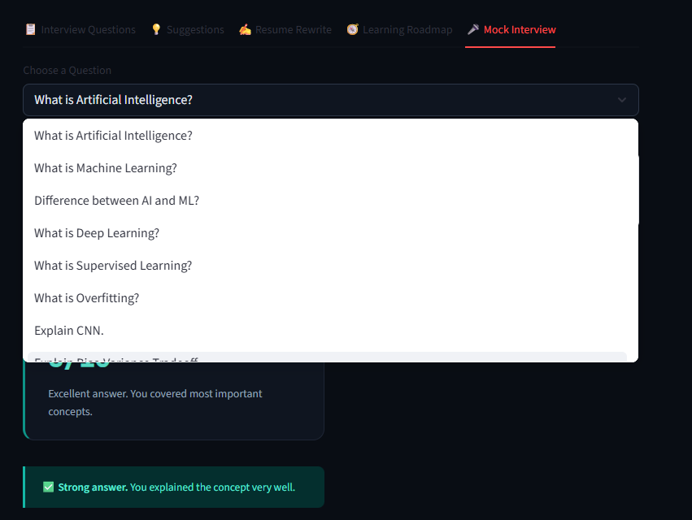
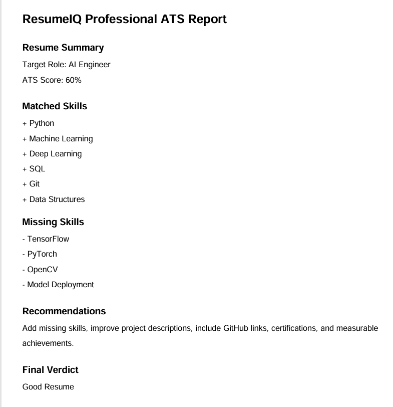

# ResumeIQ – AI-Powered ATS Resume Analyzer & Interview Coach
## 🚀 Live Demo

🔗 Hugging Face Space:
https://huggingface.co/spaces/vhvct/resumeiq-ats-analyzer

🌐 Live Application:
https://vhvct-resumeiq-ats-analyzer.hf.space

💻 GitHub Repository:
https://github.com/VHVCharanTeja/RESUME-IQ-ATS-ANALYZER

## Overview

ResumeIQ is an AI-powered Resume Analyzer and Interview Coach that helps candidates evaluate their resumes against industry job roles. The application extracts skills from resumes, calculates ATS scores, identifies missing skills, provides career recommendations, generates learning roadmaps, and conducts role-based mock interviews.

The goal is to help students, freshers, and professionals improve their resumes and prepare effectively for technical interviews.

---

## Features

### ATS Resume Analysis

* Resume PDF Upload
* ATS Match Score Calculation
* Resume Rating System
* Resume Strength Meter
* Resume Breakdown Analysis
* Resume Strengths & Weaknesses Detection

### Skill Analysis

* Automatic Skill Extraction
* Role-Based Skill Matching
* Missing Skill Detection
* Skill Gap Analysis
* Improvement Suggestions

### Job Description Matching

* Job Description Analysis
* JD Match Score
* Matched JD Skills
* Missing JD Skills

### Career Guidance

* Recommended Career Paths
* Personalized Learning Roadmap
* Resume Rewrite Suggestions
* Improvement Potential Prediction

### Mock Interview System

* 25+ Technical Roles
* 15 Questions Per Role
* Ideal Answers
* Answer Evaluation
* Interview Performance Summary

### Reporting

* ATS Report Generation
* Downloadable PDF Report

---

## Supported Roles

* AI Engineer
* Machine Learning Engineer
* Data Scientist
* Data Analyst
* Computer Vision Engineer
* NLP Engineer
* Generative AI Engineer
* Python Developer
* Java Developer
* Frontend Developer
* Backend Developer
* Full Stack Developer
* DevOps Engineer
* Cloud Engineer
* Cybersecurity Analyst
* Ethical Hacker
* SQL Developer
* Database Administrator
* Android Developer
* Flutter Developer
* QA Engineer
* Automation Tester
* Business Analyst
* Product Manager

---

## Tech Stack

### Frontend

* Streamlit

### Backend

* Python

### Data Processing

* Pandas
* NumPy

### Resume Parsing

* PyPDF2
* PDFPlumber

### Report Generation

* FPDF

### Storage

* JSON Files

---

## Folder Structure

ResumeIQ/

├── app.py

├── requirements.txt

├── README.md

│

├── datasets/

│ ├── skills.json

│ ├── skill_mapping.json

│ ├── skill_synonyms.json

│ └── interview_answers/

│

├── utils/

│ ├── ats_calculator.py

│ ├── interview_helper.py

│ ├── interview_answers.py

│ ├── report_generator.py

│ ├── roadmap_generator.py

│ └── suggestions.py

│

├── screenshots/

│ ├── home_page.png

│ ├── resume_analysis.png

│ ├── ats_score.png

│ ├── skill_matching.png

│ ├── resume_rating.png

│ ├── mock_interview.png

│ └── pdf_report.png

│

└── reports/

---

## Screenshots

### Home Page

### Resume Analysis

### ATS Score

### Skill Matching

### Resume Rating

### Mock Interview

### PDF Report

---

## How It Works

1. Upload Resume (PDF)
2. Select Target Role
3. Enter Job Description (Optional)
4. ResumeIQ Extracts Skills
5. ATS Score is Calculated
6. Missing Skills are Identified
7. Resume Rating is Generated
8. Career Recommendations are Provided
9. Mock Interview Questions are Generated
10. Download ATS Report

---

## Installation

### Clone Repository

git clone https://github.com/VHVCharanTeja/resumeiq-ats-analyzer.git

cd resumeiq-ats-analyzer

### Install Dependencies

pip install -r requirements.txt

### Run Application

streamlit run app.py

### Open Browser

http://localhost:8501

---

## Future Enhancements

* AI Resume Rewriter using LLMs
* Voice-Based Mock Interviews
* Speech-to-Text Evaluation
* Resume Ranking System
* LinkedIn Profile Analysis
* Cover Letter Generator
* AI Career Advisor
* Semantic Skill Matching
* Cloud Deployment Dashboard
* Multi-Language Resume Support

---

## Project Highlights

* 25+ Technical Roles Supported
* 375+ Interview Questions & Answers
* ATS Score Engine
* Resume Rating System
* Skill Gap Analysis
* Career Recommendations
* Learning Roadmaps
* Mock Interview Coach
* PDF Report Generator

---

## Author

VEERELLA HIMA VENKATA CHARAN TEJA

B.Tech CSE (AI & ML)

Sathyabama University

GitHub: https://github.com/VHVCharanTeja

LinkedIn: https://www.linkedin.com/in/veerella-hima-venkata-charan-teja-556177412

---

⭐ If you found this project useful, consider giving it a star on GitHub.
